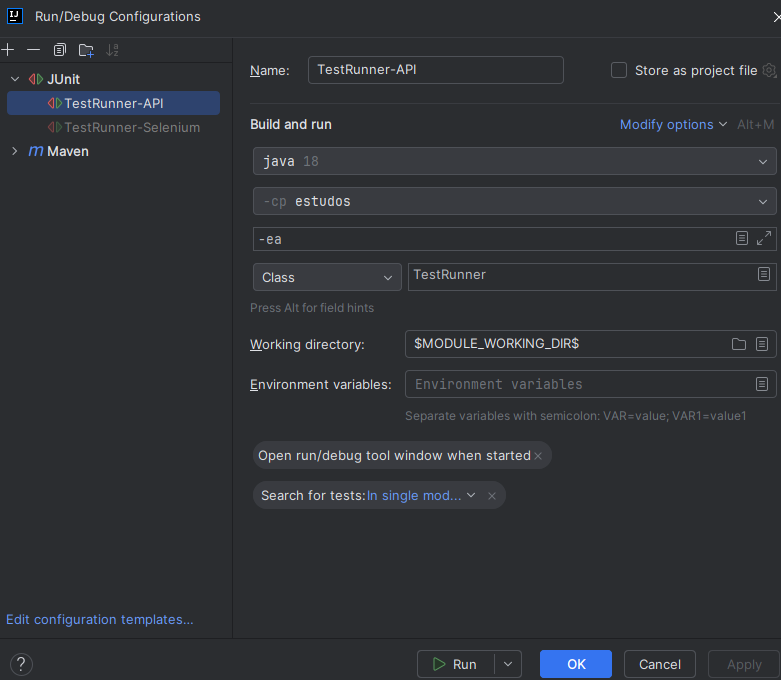
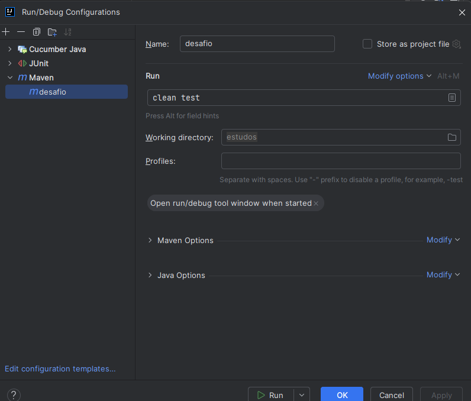
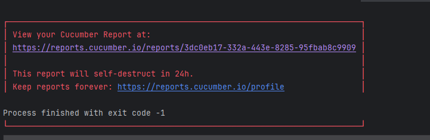

# Pré-requistos
- Firefox 125.0.2
- Java 18
- Maven 3.9...

# Execução

- O teste de API pode ser executado dentro do projeto de API \API\src\test\java\StepDefinitions\TestRunner.java
  
- O teste de Selenium pode ser executado dentro do projeto de Selenium \Selenium\src\test\java\StepDefinitions\TestRunner.java

- Também é possível configurar para rodar o maven e o teste

# Relatório
- Após a execução dos testes o cucumber irá gerar uma URL que consta o resultado dos testes

